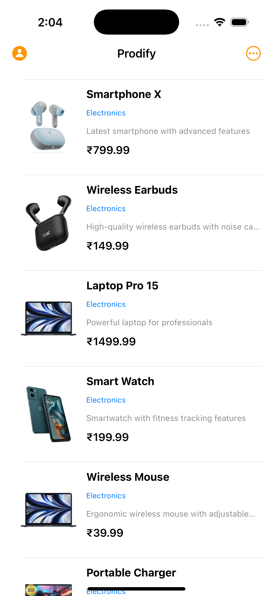
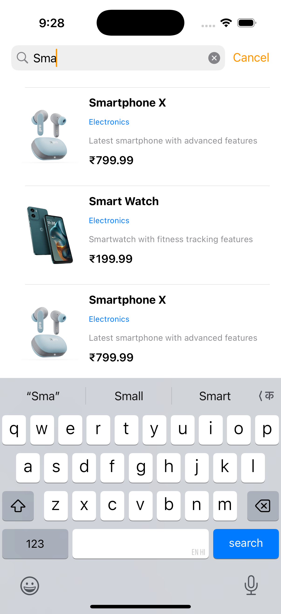
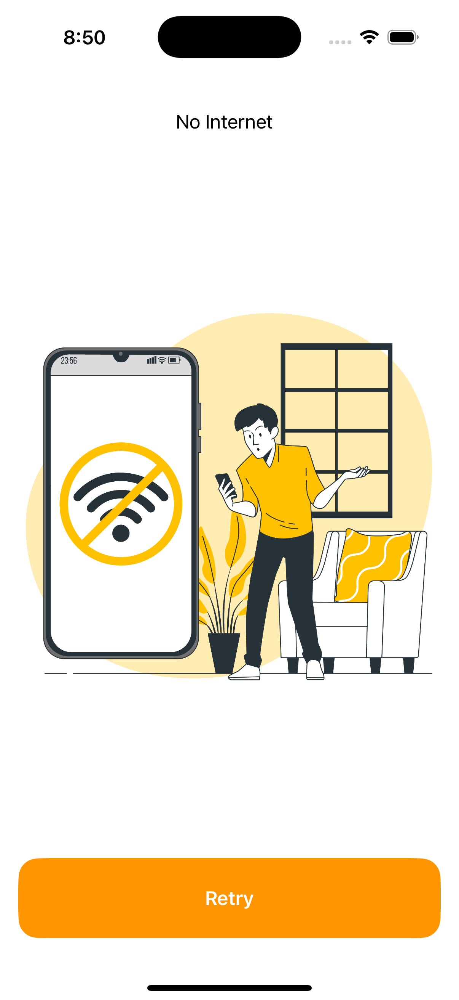

# Prodify - Paginated Products iOS App

**Assignment Project – Powerhouse iOS Challenge**  

This iOS app demonstrates a paginated product list with networking, search functionality, and error handling using **UIKit** and **MVVM** architecture.  

---

## Features

1. **Paginated Product List**  
   - Fetches products from a paginated API.  
   - Smooth scrolling with lazy image loading.  
   - Handles missing images with local placeholders.  

2. **Search Products**  
   - Native search bar filters products by title.  
   - Real-time results update while typing.  

3. **Product Detail Screen**  
   - Tap on a product to see detailed information.  
   - Includes product image, title, category, description, and price.  

4. **No Internet Handling**  
   - Dedicated “No Internet” screen with retry button.  
   - Loader while checking for connectivity.  

5. **Error & Loading States**  
   - Shows spinner during network calls.  
   - Displays “No Data” view if API returns empty results.  

---

## Screenshots

| Product List        | Search View         | Product Detail      | No Internet Screen  |
|--------------------|-------------------|-------------------|-------------------|
|  |  |  |  |Internet Screen |  |

---

## Architecture

- **MVVM Pattern**: Separates view logic and data logic for cleaner structure.  
- **Protocols & Delegates**: Used for networking and view updates.  
- **Lazy Loading**: Images load asynchronously for better performance.  

---

## Challenges & Solutions

1. **Missing Images**  
   - Some API responses had no images.  
   - Solution: Use local placeholder images and map them consistently to products.  

2. **No Internet Handling**  
   - App crashed or froze when offline.  
   - Solution: Dedicated screen with retry and loader. Minor delay still exists (~2–3 sec).  

3. **Data Parsing**  
   - Initial API response could not be decoded correctly.  
   - Solution: Adjusted Codable structs and added robust error handling.  

---

## How to Run

1. Clone the repo.  
2. Open `Prodify.xcworkspace` in Xcode 15+.  
3. Build and run on simulator or device.  
4. Navigate through product list, search, and detail screens.  

---

## Notes

- Demo video and PDF documentation are included for reference.  
- All assets are included in `Assets.xcassets`.  

---
